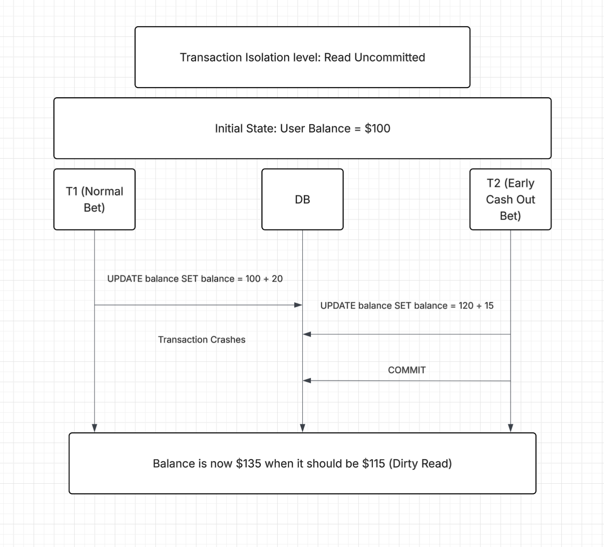
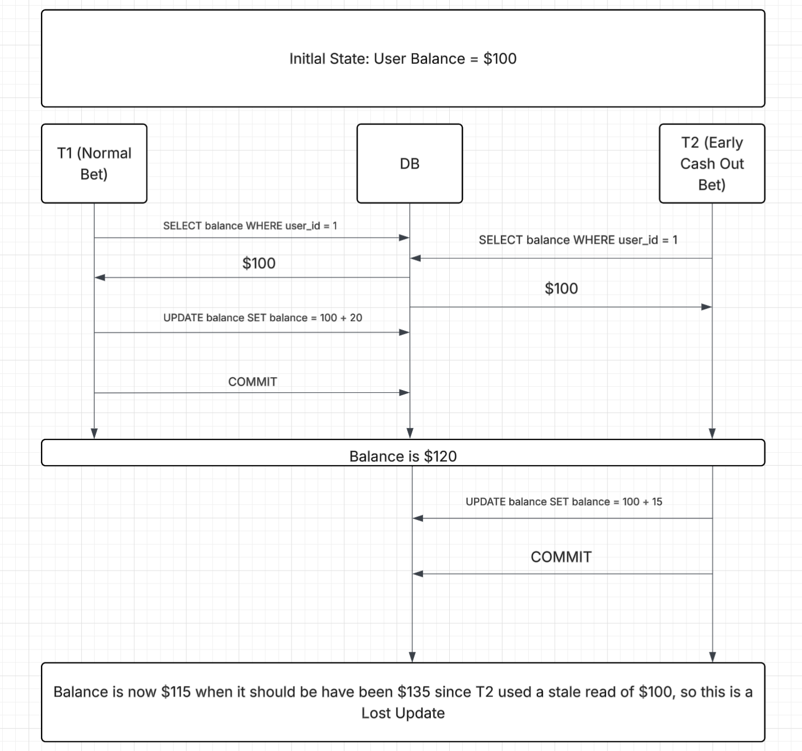
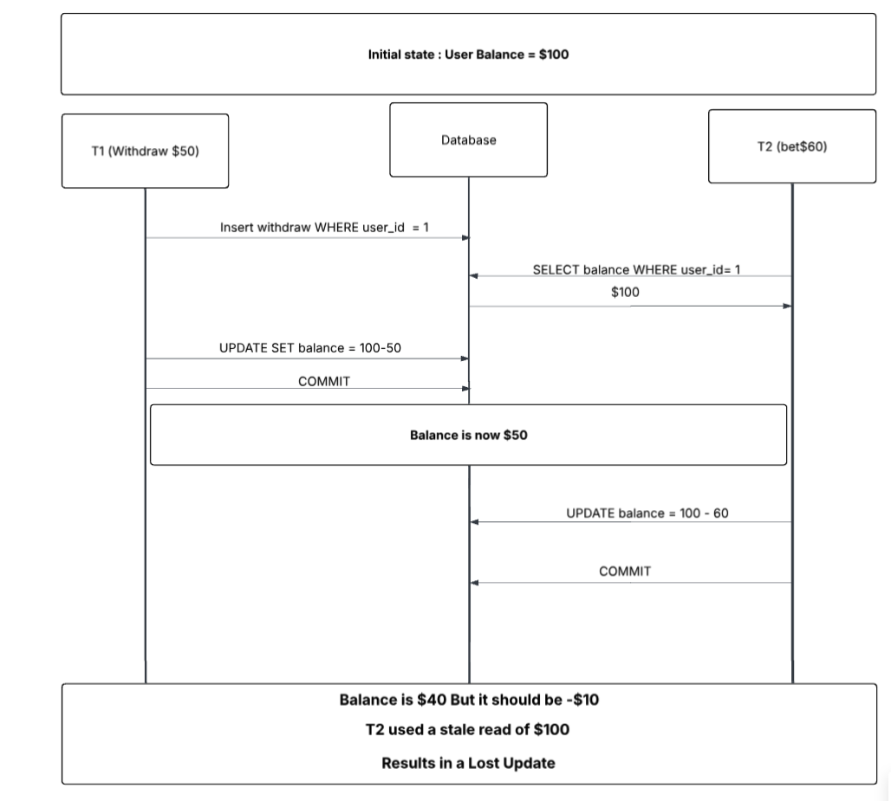

# Concurrency Control in All-Or-Nothing

## Case 1 — Lost Update: Double Spend on `POST /bets`

### Phenomenon: Lost Update

Two concurrent bet requests from the same user both read the balance before either commits. Both see a sufficient balance. Both proceed to deduct. One deduction overwrites the other, and the user effectively spends the same money twice, therefore balance goes negative, or one update is gone and data shows as if only 1 bet was placed.

## Case 2 - Dirty Read and Lost Update: Cashing out a bet early while another bet is being resolved on `POST /bets/early`

### Phenomenon: Dirty Read

When cashing out a bet early, the program will calculate a payout and updates the balance. If another bet were to update the balance before the early cashed out bet and then it  crashes and rolls back the balance, the early cashed out bet could have updated the balance using the uncommitted balance change which would have been a dirty read.

To fix this issue, the transaction should be set to at least Read Committed so that dirty reads don’t happen.

### Phenomenon: Lost Update

Another issue is when the early cashed out bet reads the current balance and uses that balance to update it in two separate queries.  If another bet were to update the balance before the early cashed out bet updates the balance, the early cashed out bet would end up overwriting the newly updated balance resulting in a lost update.

To fix this issue, the balance should be read while updating such as for example, UPDATE balance SET balance = balance + 20, so that the balance is the most up to date and so there is a lock on that data while it is being updated by a transaction. 

## Case 3 - Lost Update: Withdrawing money while a new bet is processing

A third situation that can happen is where a user accumulates a lot of money and decides to cash some part of it and wager another part. With no concurrency control this would cause a Lost Update where...

Both the "withdraw" endpoint and the bet function use the same bet amount even though the "bets" endpoint should be using the balance AFTER it was updated by the "withdraw" endpoint. This would cause either a negative balance or incorrect balance tracking. 

